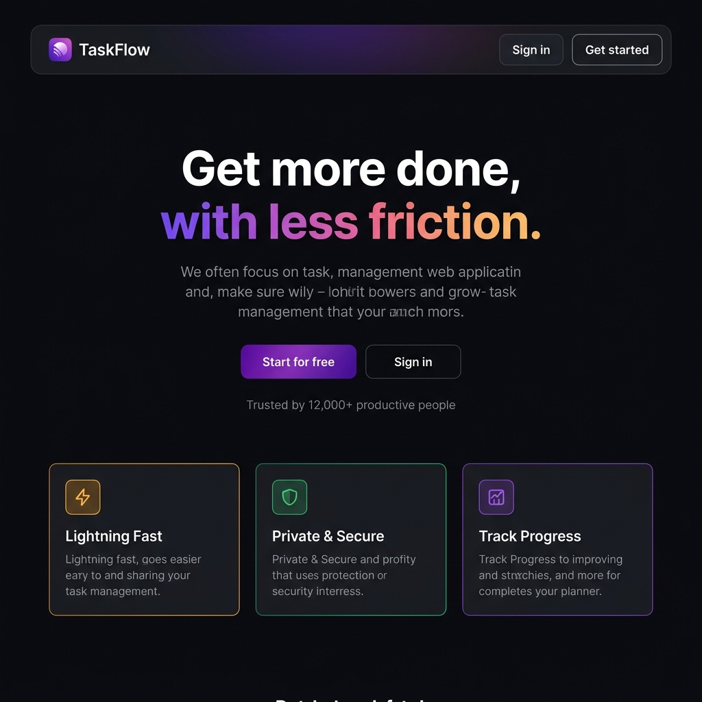
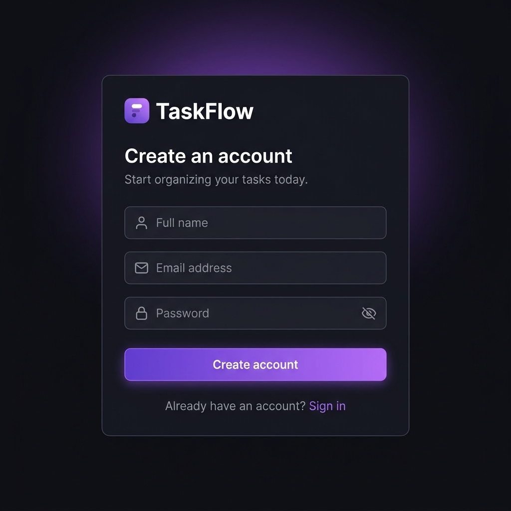
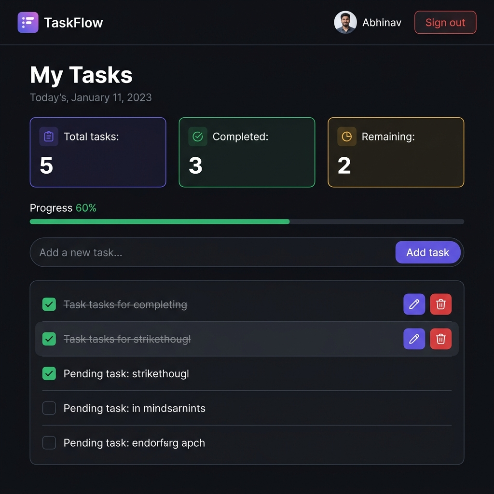

<div align="center">
  

  <h1>TaskFlow</h1>
  <p><strong>A minimal, fast full-stack todo app — built for focus, not friction.</strong></p>

  <p>
    
    
    
    
    
    
  </p>

  <p>
    <a href="https://todo-c-amber.vercel.app">🌐 Live Demo</a> ·
    <a href="#-features">Features</a> ·
    <a href="#-tech-stack">Tech Stack</a> ·
    <a href="#-getting-started">Getting Started</a>
  </p>
</div>

---

## 📸 Screenshots

<table>
  <tr>
    <td align="center">
      
      <br /><sub><b>Landing Page</b></sub>
    </td>
  </tr>
  <tr>
    <td align="center">
      
      <br /><sub><b>Sign Up / Sign In</b></sub>
    </td>
  </tr>
  <tr>
    <td align="center">
      
      <br /><sub><b>Dashboard</b></sub>
    </td>
  </tr>
</table>

---

## ✨ Features

- 🔐 **JWT Authentication** — Secure register & login with hashed passwords (bcrypt)
- ✅ **Full CRUD** — Create, read, update, and delete tasks in real time
- 📊 **Progress Tracking** — Visual progress bar and stat cards (total / completed / remaining)
- 🌑 **Premium Dark UI** — Inter font, consistent design tokens, smooth micro-animations
- ⚡ **Vite + React 18** — Blazing-fast HMR dev experience
- ☁️ **MongoDB Atlas** — Cloud-hosted database with Mongoose ODM
- 🔄 **Persistent Sessions** — Auth token stored in `localStorage`; session restores on reload
- 🚀 **Vercel Ready** — Frontend and backend both deployable to Vercel

---

## 🛠 Tech Stack

| Layer | Technology |
|---|---|
| **Frontend** | React 18, Vite 6, Tailwind CSS v4, Lucide React |
| **Backend** | Node.js, Express.js |
| **Database** | MongoDB Atlas + Mongoose |
| **Auth** | JSON Web Tokens (JWT) + bcryptjs |
| **Deployment** | Vercel (frontend + backend) |

---

## 🚀 Getting Started

### Prerequisites

- Node.js 18+
- A [MongoDB Atlas](https://cloud.mongodb.com) cluster (free tier works)

### 1. Clone the repo

```bash
git clone https://github.com/abhinavkajeev/todo.c.git
cd todo.c
```

### 2. Setup the Backend

```bash
cd backend
npm install
```

Create a `.env` file in `backend/`:

```env
MONGODB_URI=mongodb+srv://<user>:<password>@cluster0.xxxx.mongodb.net/todo-app
JWT_SECRET=your_super_secret_key
PORT=5001
```

Start the backend:

```bash
node server.js
# Server is running on port 5001
# Connected to MongoDB
```

### 3. Setup the Frontend

```bash
cd ../frontend
npm install
npm run dev
```

Open [http://localhost:5174](http://localhost:5174) 🎉

> **Note:** The Vite dev server is pre-configured to proxy `/api` requests to `http://localhost:5001` automatically.

---

## 📁 Project Structure

```
todo.c/
├── backend/
│   ├── server.js          # Express app, routes, Mongoose models
│   ├── .env               # Environment variables (not committed)
│   ├── vercel.json        # Vercel deployment config
│   └── package.json
│
├── frontend/
│   ├── src/
│   │   ├── main.jsx       # React entry point
│   │   ├── index.css      # Global styles & design tokens
│   │   ├── TodoApp.jsx    # Root component & state management
│   │   ├── LandingPage.jsx
│   │   ├── AuthForm.jsx
│   │   └── Dashboard.jsx
│   ├── index.html
│   ├── vite.config.js     # Vite + proxy config
│   └── package.json
│
├── screenshots/           # README preview images
└── README.md
```

---

## 🌐 Deployment

### Frontend (Vercel)

1. Push to GitHub
2. Import the repo in [Vercel](https://vercel.com)
3. Set **Root Directory** to `frontend`
4. Deploy — Vercel auto-detects Vite

### Backend (Vercel)

1. Import the same repo again (or use a separate project)
2. Set **Root Directory** to `backend`
3. Add environment variables: `MONGODB_URI`, `JWT_SECRET`, `PORT`
4. Deploy

Then update `API_BASE` in `frontend/src/TodoApp.jsx` to your deployed backend URL:

```js
const API_BASE = 'https://your-backend.vercel.app/api';
```

---

## 🔑 API Reference

| Method | Endpoint | Auth | Description |
|---|---|---|---|
| `POST` | `/api/auth/register` | ❌ | Register a new user |
| `POST` | `/api/auth/login` | ❌ | Login & receive JWT |
| `GET` | `/api/todos` | ✅ | Get all todos for current user |
| `POST` | `/api/todos` | ✅ | Create a new todo |
| `PUT` | `/api/todos/:id` | ✅ | Update a todo (text or completed) |
| `DELETE` | `/api/todos/:id` | ✅ | Delete a todo |
| `GET` | `/api/health` | ❌ | Server health check |

---

## 📄 License

MIT © [abhinavkajeev](https://github.com/abhinavkajeev)
